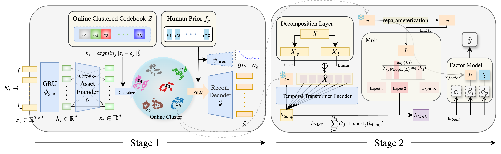

# Vector-Quantized Discrete Latent Factors Meet Financial Priors: Dynamic Cross-Sectional Stock Ranking Prediction for Portfolio Construction

<div align="center">

[](https://www.python.org/)
[](https://pytorch.org/)
[](https://opensource.org/licenses/MIT)
[](https://github.com)

</div>

This repository contains the implementation of **PRISM-VQ** (PRior-Informed Stock Model with Vector Quantization), a unified dynamic factor model for stock return prediction.

📄 **Paper**: Accepted at IJCAI-ECAI 2026

---

## 📋 Abstract

Stock return prediction presents several unique challenges that motivate our architectural design. Financial time series exhibit extremely low signal-to-noise ratios, with predictable components often masked by market microstructure noise and idiosyncratic shocks. Additionally, stocks do not evolve independently—their returns exhibit complex cross-sectional dependencies driven by industry relationships, supply chain connections, and correlated investor behavior. Market regimes shift over time, requiring models to adapt factor loadings dynamically rather than assuming stationarity. Finally, practitioners require interpretable models that align with financial theory, as black-box predictions are difficult to validate and deploy in regulated environments.

<div align="center">
  
  <p><em>Architecture of PRISM-VQ. The spatial learning stage (left) learns discrete stock representations via vector quantization over cross-sectional features. The temporal learning stage (right) uses these discrete codes to gate expert networks, generating dynamic factor loadings that fuse expert prior factors and learned latent factors for return prediction.</em></p>
</div>

## 🎯 Key Contributions

- **Unified Framework**: We propose PRISM-VQ, a unified dynamic factor model that systematically integrates expert prior factors, data-driven discrete latent factors, and adaptive temporal modeling. To our knowledge, this is the first framework to combine these three components within a principled factor model structure.

- **Vector Quantization**: We introduce vector quantization as an inductive bias for learning robust cross-sectional factors in financial markets. We demonstrate that discrete representations provide superior regularization compared to continuous alternatives in low signal-to-noise environments.

## 🚀 Installation

### 📦 Requirements

```
Python 3.11
PyTorch 2.4.1
Qlib 0.9.6.99
Hydra & OmegaConf
```

### 🔧 Setup

```bash
# Clone the repository
git clone https://github.com/x7jeon8gi/PRISM-VQ.git
cd PRISM-VQ

# Install dependencies
pip install -r requirements.txt
```

## 📊 Data Preparation

The model uses two data sources:

1. **Qlib Data**: Stock market data from Qlib's data repository
2. **JKP Global Factors**: Jensen, Kelly, and Pedersen (JKP) global factor data


## 🏋️ Training

The model training consists of two stages:

### Stage 1: VQ-VAE Training
```bash
python stage1.py
```

### Stage 2: Predictive Model Training
```bash
python stage2.py
```

### ⚙️ Configuration

All model configurations are managed through Hydra configuration files located in `configs/`. Key parameters include:

- `data.universe`: Choose between 'sp500' or 'csi300'
- `vqvae.num_embed`: Number of codebook entries
- `predictor.n_expert`: Number of experts in MoE
- `stage2_presets`: Market-specific Stage 2 defaults for checkpoint, auxiliary weight, MoE experts, and attention heads. `stage2.py` applies these automatically from `data.universe`.


## 📁 Project Structure

```
PRISM-VQ/
├── 📂 configs/           # Hydra configuration files
├── 📂 dataset/           # Data loading and processing
├── 📂 module/            # Model architecture components
│   ├── 📄 autoencoder.py
│   ├── 📄 quantise.py
│   └── 📂 layers/
├── 📂 trainer/           # Training scripts
├── 📂 utils/             # Utility functions
├── 🚀 stage1.py          # Stage 1 training entry point
└── 🚀 stage2.py          # Stage 2 training entry point
```


## 📄 License

This project is licensed under the MIT License - see the [LICENSE](LICENSE) file for details.

## 🙏 Acknowledgments

We thank the Qlib team for providing the financial data infrastructure and the authors of the JKP factors for making their data publicly available. We also acknowledge the [CVQ-VAE](https://github.com/lyndonzheng/CVQ-VAE) project for inspiration on vector quantization techniques.
